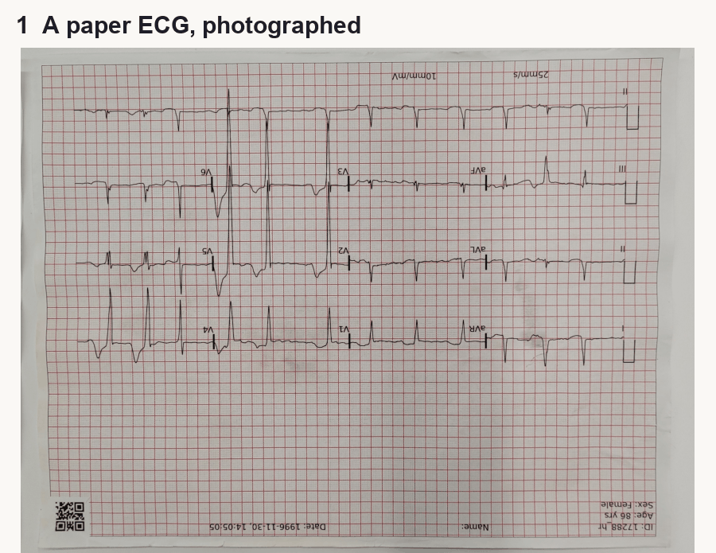

# Pixels2Physiology

**Automatic paper ECG digitisation, Image to CSV Pipeline.**

### ▶ [Interactive demo: Automatic ECG Digitalisation](https://rociomexiadiaz.github.io/Pixels2Physiology/)



Decades of ECGs exist only on paper, as scans and photos. A computer can't analyse a picture of a heartbeat. This pipeline takes the picture, however damaged (phone photos, stains, mould, upside down), and returns 12 leads in millivolts as a CSV. It runs on an ordinary laptop in about 4 seconds a page.

## How it works

| # | Step | How | File |
|---|---|---|---|
| 1 | Photo in | pad and resize to a standard canvas | `p2p/preprocess.py` |
| 2 | Find the paper | U-Net | `p2p/crop.py` |
| 3 | Flatten & rotate | fit corners, perspective warp, 180° check | `p2p/crop.py`, `p2p/orient.py` |
| 4 | Cut the strips | standard 12-lead layout has fixed 4 rows | `p2p/strips.py` |
| 5 | Lift the ink | U-Net | `p2p/strips.py` |
| 6 | Measure | pixels dimension → mV | `p2p/digitise.py` |

## Results (held-out validation set)

Scored on **176 records the models never saw**, each at one of 8 damage types, with the seeded split from the paper (`scripts/evaluate.py`).

| | |
|---|---|
| Mean RMSE per lead | **0.199 mV**, about 2 small squares on standard ECG paper |
| Mean correlation | 0.70 |
| Time per page | ~4 s on a laptop (Apple-silicon GPU), no cloud |

By damage type (mean RMSE, mV):

| Damage type | RMSE (mV) |
|---|---|
| Colour scan | 0.181 |
| Black & white scan | 0.181 |
| Stained photo, sideways | 0.182 |
| Mould, colour scan | 0.183 |
| Mould, black & white scan | 0.191 |
| Phone photo of a printout | 0.213 |
| Phone photo of a screen | 0.218 |
| Damaged printout | 0.219 |

<details><summary>Per lead</summary>

| Lead | RMSE (mV) | Correlation |
|---|---|---|
| I | 0.161 | 0.681 |
| aVR | 0.155 | 0.696 |
| V1 | 0.172 | 0.762 |
| V4 | 0.296 | 0.638 |
| II | 0.173 | 0.680 |
| aVL | 0.124 | 0.720 |
| V2 | 0.271 | 0.758 |
| V5 | 0.265 | 0.653 |
| III | 0.146 | 0.712 |
| aVF | 0.135 | 0.719 |
| V3 | 0.274 | 0.738 |
| V6 | 0.216 | 0.675 |
</details>

RMSE is computed after aligning each lead by up to ±0.2 s and one constant vertical offset (`p2p/metrics.py`).

**Known limits:** very tall peaks that run past their strip get clipped; the strip layout is fixed to the standard 4-row format; not clinically validated.

## Use it

```bash
pip install -r requirements.txt
python scripts/digitise.py scan.png --fs 500 --figure          # -> out/scan.csv + out/scan.png
                                                               #    (first run downloads the 2 models, ~250 MB)
python scripts/digitise.py folder_of_scans/ --fs 500 --out out/  # batch; pages missing a lead print CHECK
```

```python
from p2p import Pipeline
result = Pipeline.from_pretrained().run("scan.png", n_samples=5000)
result.signals_dataframe(fs=500, n_samples=5000).to_csv("ecg.csv")
result.document, result.strip_masks, result.flipped   # every intermediate is kept
```

## Repo layout

```
p2p/                   the library, one file per stage
  config.py            every fixed number (canvas, strip rows, paper scale, norms)
  preprocess.py        step 1
  crop.py              steps 2-3 (UNet-1 + geometry)
  orient.py            upside-down check
  strips.py            steps 4-5 (cut + UNet-2)
  digitise.py          step 6
  models.py            the two networks and their losses
  metrics.py           aligned RMSE / correlation
  pipeline.py          Pipeline: runs it all, keeps every intermediate
  orb.py, render.py, data.py   training-data automation and datasets
scripts/
  digitise.py          CLI: image(s) -> CSV (+ check sheet)
  evaluate.py          score the pipeline on the held-out validation set
  make_masks.py        auto-label paper masks with ORB
  train_unet1.py       train the paper finder
  train_unet2.py       train the ink finder
  make_demo_assets.py  run real records and export every step for docs/
  make_diagram_assets.py  real outputs for the 'under the hood' diagram
  build_site_data.py   bundle samples + metrics for the web page
docs/                  the interactive demo (GitHub Pages)
tests/                 quick checks on the rule-based steps (pytest)
pixels2physiology.ipynb  the original Kaggle notebook
```

The scripts are a modular version of the notebook (`pixels2physiology.ipynb`, also on [Kaggle](https://www.kaggle.com/code/rociomexia/ecg-physionetchallenge-6)). The released weights are the notebook's. 

## Data

[PhysioNet 2025 ECG Image Digitisation Challenge](https://www.kaggle.com/competitions/physionet-ecg-image-digitization): images generated with ECG-Image-Kit from [PTB-XL](https://physionet.org/content/ptb-xl/) records (CC BY 4.0). The six images on the demo page are validation records from that dataset, shown for illustration.

## Citation

```
Mexia Diaz, R. (2025). From Pixels to Physiology: A Two-Stage U-Net Approach for ECG Signal Recovery.
PhysioNet 2025 ECG Image Digitisation Challenge.
```
